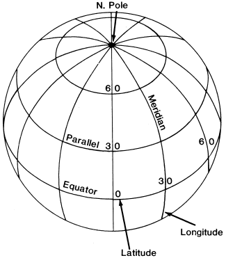
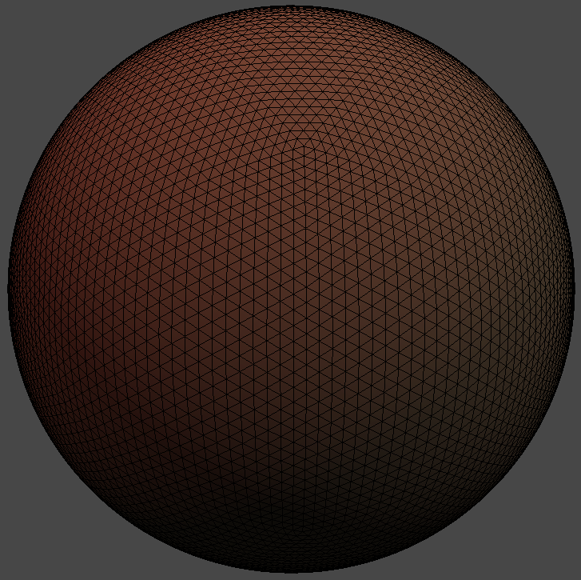

_Update: At long last, the SO answer has been found! Added a link._

Lately I’ve been shrinking my goals so that I can actually reach them. I mean, I’d rather have fifty small projects that have all been completed than ten large ones that haven’t (you wouldn’t believe how many things I have 90% completed in my life).

Anyway, a few weeks ago I gave myself the rather small goal of procedurally generating a spherical mesh. I’ve done a lot with terrain generation, but never with spherical terrain. My initial idea was just to mimic a globe:

[](images/lat_long-96513c6a.png)

There’s nothing fancy here–I would probably use polar coordinates to rotate about and create longitudinal vertices, then move up the sphere. Easy peasy. But then, if you look at the poles, you see there’s a lot of wasted geometry. In fact, to even get a mesh looking like a sphere, there has to be a lot of wasted geometry at the poles for quads around the equator to look even marginally curved.

There had to be a better way.

Luckily, [StackOverflow](http://gamedev.stackexchange.com/questions/31308/algorithm-for-creating-spheres/31312#31312) alerted me that a common approach to this problem is by using a “geosphere” rather than a “lat-long sphere”. Yah, that’s what they say in the biz.

# What’s a GeoSphere?

The idea behind a geosphere is simple: start with any simple regular polyhedra, and subdivide the mesh until you have the desired mesh resolution. [The particular StackOverflow answer](http://gamedev.stackexchange.com/questions/31308/algorithm-for-creating-spheres/31312#31312) gave a simple method to generate a unit icosahedron, so that’s what I started with too. An icosahdron is made up of equilateral triangles, so if you subdivide the triangles into equilateral triangles, the geometry is evenly distributed across the mesh.

The method needed some reworking, but was easy to port to Unity:

```
public static Shape Icosahedron() {
	Shape icosahedron = new Shape();
	icosahedron.indices =
		new int[]
		{
			1,4,0,
			4,9,0,
			4,5,9,
			8,5,4,
			1,8,4,
			1,10,8,
			10,3,8,
			8,3,5,
			3,2,5,
			3,7,2,
			3,10,7,
			10,6,7,
			6,11,7,
			6,0,11,
			6,1,0,
			10,1,6,
			11,0,9,
			2,11,9,
			5,2,9,
			11,2,7
		};

	var X = 0.525731112119133606f;
	var Z = 0.850650808352039932f;

	icosahedron.vertices =
		new Vector3[]
		{
			new Vector3(-X, 0f, Z),
			new Vector3(X, 0f, Z),
			new Vector3(-X, 0f, -Z),

			new Vector3(X, 0f, -Z),
			new Vector3(0f, Z, X),
			new Vector3(0f, Z, -X),

			new Vector3(0f, -Z, X),
			new Vector3(0f, -Z, -X),
			new Vector3(Z, X, 0f),

			new Vector3(-Z, X, 0f),
			new Vector3(Z, -X, 0f),
			new Vector3(-Z, -X, 0f)
		};

	return icosahedron;
}
```

My Shape class simply contains vertex and index buffers.

```
public class Shape
{
    public int[] indices
    {
        get;
        set;
    }

    public Vector3[] vertices
    {
        get;
        set;
    }
}
```

The fun part is the subdivision of the mesh. Since each triangle is equilateral, we can subdivide the mesh by taking the midpoints of each side of each triangle to create four triangles from each existing triangle.

[](images/midpoints-84c3f960.png)

The article had an example of how to do this with a hash. Here is the complete implementation of triangle subdivision:

```
private static void Subdivide(Shape shape) {
	// cache of midpoint indices
	var midpointIndices = new Dictionary();

	// get references to arrays
	int[] indices = shape.indices;
	Vector3[] vertices = shape.vertices;

	// create lists instead...
	List indexList = new List(4 * indices.Length);
	List vertexList = new List(vertices);

	// subdivide each triangle
	for (var i = 0; i < indices.Length - 2; i += 3) {
		// grab indices of triangle
		int i0 = indices[i];
		int i1 = indices[i + 1];
		int i2 = indices[i + 2];

		// calculate new indices
		int m01 = getMidpointIndex(midpointIndices, vertexList, i0, i1);
		int m12 = getMidpointIndex(midpointIndices, vertexList, i1, i2);
		int m02 = getMidpointIndex(midpointIndices, vertexList, i2, i0);

		indexList.AddRange(
			new[] {
				i0,m01,m02,
				i1,m12,m01,
				i2,m02,m12,
				m02,m01,m12
			});
	}

	// save
	shape.indices = indexList.ToArray();
	shape.vertices = vertexList.ToArray();
}

private static int getMidpointIndex(Dictionary midpointIndices, List vertices, int i0, int i1) {
	// create a key
	string edgeKey = string.Format("{0}_{1}", Mathf.Min(i0, i1), Mathf.Max(i0, i1));

	int midpointIndex = -1;

	// if there is not index already...
	if (!midpointIndices.TryGetValue(edgeKey, out midpointIndex)) {
		// grab the vertex values
		Vector3 v0 = vertices[i0];
		Vector3 v1 = vertices[i1];

		// calculate
		var midpoint = (v0 + v1) / 2f;

		// save
		if (vertices.Contains(midpoint)) {
			midpointIndex = vertices.IndexOf(midpoint);
		} else {
			midpointIndex = vertices.Count;
			vertices.Add(midpoint);
		}
	}

	return midpointIndex;
}
```

Now it’s simply a matter of putting all of this together to create a geosphere shape of the desired resolution:

```
public static Shape GeoSphere(int quality)
{
	// create icosahedron + subdivide
	Shape icosahedron = Icosahedron();
	for (int i = 0; i < quality; i++)
	{
		Subdivide(icosahedron);
	}

	Normalize(icosahedron);

	return icosahedron;
}
```

I didn’t mention it, but as you can see above, the trick is normalizing all of the vertices after subdivision occurs. This is so that each vertex is the same distance from the center of the sphere, otherwise the icosahedron would continue to look like an icosahedron.

This code simply creates a mesh, so it’s a simple matter of adding that to a GameObject instance MeshFilter component:

```
// create gameobject
_gameObject = new GameObject("geosphere");
_gameObject.AddComponent();
_gameObject.AddComponent();
_gameObject.renderer.material.mainTexture = (Texture)Resources.Load("dirt");

// create geometry
Shape geosphere = GeometryProvider.GeoSphere(5);

// create mesh
_mesh = _gameObject.GetComponent().mesh;
_mesh.vertices = geosphere.vertices;
_mesh.triangles = geosphere.indices;
_mesh.Optimize();
_mesh.RecalculateNormals();
```

Finally, after all of that, we’re left with a sphere with no wasted geometry:

[](images/geosphere-9f905fe9.png)

Isn’t it beautiful?