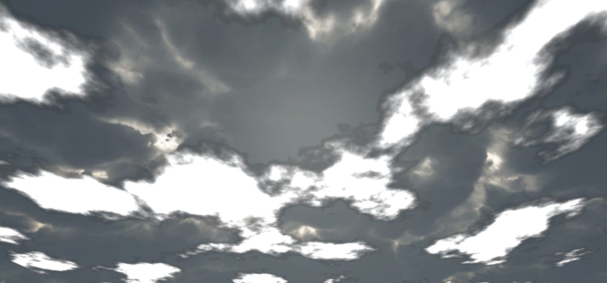

Update: The source can be found on [GitHub](https://github.com/thegoldenmule/RealtimeClouds "Real time clouds can Git it!").

In [part one](https://thegoldenmule.com/blog/?p=708 "Real-Time Clouds Pt 1: A Study of Noise Functions") of this thrilling diptych I unveiled my beautiful classic noise function on the world using many many lines of someone else’s code. Well in this post I hope to further bedazzle you by actually using that noise function– and even some of my own code. W00t.

## Old Man Perlin and His Noise

I don’t actually know how old Perlin is, but I’m going to guess the he has, at one time, worn really big sunglasses that even block sun from entering sideways and he probably has pretty full facial hair. He likes to play board games, can only handle two beers in a sitting, and can do useless things with Arduinos (oh crap, I’m describing myself– except for the old and bearded part).

Perlin came up with a great idea: for a classic noise function $$f$$,

$$!f\_{perlin} = \\sum\\limits\_{i}^n f(x / 2^i) \* 2^i$$

That is, he composed multiple frequencies of classic noise together, in what’s called a _fractal sum_. In order to get real-time clouds, all I really need to do is to translate my classic noise function whilst summing, then translate the entire sum as well. It’s exactly as easy as it sounds.

First the shader:

```
uniform float _T;

float fractalSum(float2 Q) {
	float value = 0;

	// add frequencies
	value += noise(Q / 4) * 4;
	value += noise(Q / 2) * 2;
	value += noise(Q);
	value += noise(Q * 2) / 2;
	value += noise(Q * 4) / 4;
	value += noise(Q * 8) / 8;
	value += noise(Q * 16) / 16;

	return value;
}

half4 frag(v2f i) : COLOR {
	float value = fractalSum((i.uv + float2(_T, _T))* 32 + 240);
	return half4(value, value, value, value);
}
```

And the C#:

```
private float _t = 0f;
public float translationSpeed = 0.0001f;
void Update () {
	_t += translationSpeed;

	MeshRenderer renderer = gameObject.GetComponent().material.SetFloat("_T", _t);
}
```

As you can see, I’ve added a float \_T, and a function called fractalSum() to the fragment shader. The UVs are simply translated by an amount \_T so that the clouds scroll across the material. In fractalSum(), you can see the summation of multiple frequencies of classic noise, from $$i=-2…4$$. The result:

[](https://thegoldenmule.com/blog/?attachment_id=735)

At this point, I’ve got static clouds translating, but I want the clouds to actually morph as the move and I want to be able to change the color of the clouds. It takes just a couple of tweaks to my fractalSum and frag functions:

```
float fractalSum(float2 Q) {
	float value = 0;

	// add frequencies
	value += noise(Q / 4 + _R1) * 4;
	value += noise(Q + _R2);
	value += noise(Q * 2 + _R3) / 2;
	value += noise(Q * 4 + _R4) / 4;
	value += noise(Q * 8 + _R5) / 8;
	value += noise(Q * 16 + _R6) / 16;

	return value;
}

half4 frag(v2f i) : COLOR {
	float value = fractalSum((i.uv + float2(_T, _T))* 32 + 240);
	return half4(value, value, value, value) * _Tint;
}
```

The values \_R1 through \_R6 are random offsets, which makes the clouds change shape while they are translating. Additionally, I added a simple \_Tint property so the color of the clouds could be changed easily.

For the input values of \_R1 through \_R6, I have six PRNGs that pump random variations into the shader. This could just as easily be one PRNG, but hey, this seems cleaner.

```
private System.Random[] _prngs = new System.Random[6] {
	// just a few primes for seeds
	new System.Random(8887),
	new System.Random(1109),
	new System.Random(400157),
	new System.Random(200159),
	new System.Random(299807),
	new System.Random(499787)
};

// to keep the current values
private float[] _rs = new float[6];

// time
private float _t = 1;

public float translationSpeed = 0.0001f;
public float morphSpeed = 0.001f;

public bool translationEnabled = true;
public bool morphEnabled = true;

void Update () {
	MeshRenderer renderer = gameObject.GetComponent();

	if (translationEnabled)
	{
		_t += translationSpeed;

		renderer.material.SetFloat("_T", _t);
	}

	if (morphEnabled)
	{
		for (int i = 1; i < _prngs.Length + 1; i++)
		{
			_rs[i - 1] += (float)_prngs[i - 1].NextDouble() * morphSpeed;
			renderer.material.SetFloat("_R" + i.ToString(), _rs[i - 1]);
		}
	}
}
```

##  A Simpler Approach?

That was a lot of work for some decent looking clouds. As I commented in [part one](https://thegoldenmule.com/blog/?p=708 "Real-Time Clouds Pt 1: A Study of Noise Functions"), one way to simplify this whole process is to generate the gradient lattice texture in the fragment shader rather than on the CPU. Additionally, this frees up texture space. Lucky for me, my coworker sent me a [link](http://glsl.heroku.com/e#6294.0 "Those clouds look a lot better than mine...") to a nice example of just such a method:

```
float4 textureRND2D(float2 uv){
	uv = floor(frac(uv) * 1000);
	float v = uv.x + uv.y * 1000;
	return frac(100000 * sin(float4(v * 0.001, (v + 1.) * 0.001, (v + 1000) * 0.001, (v + 1000 + 1.) * 0.001)));
}
```

Now, I can replace tex2D calls where I sampled a texture, with a function that mimics the same behavior. The resulting noise function looks pretty similar to real classic noise:

[](https://thegoldenmule.com/blog/?attachment_id=736)

And the resulting clouds look pretty good too:

[](https://thegoldenmule.com/blog/?attachment_id=737)

I’m actually pretty surprised with the result. The clouds do look a bit different, but I’m not quite sure what about them is strange. If you look at the two screenshots side by side, you’ll see what I’m talking about. Using the function that emulates the texture sampling results in rougher Perlin noise, but it’s much simpler to implement.

## Additional Thoughts

I’m not crazy about my clouds, but they are a decent start. I’d be interested in introducing volume so the clouds don’t look so sharp. I’d also love to try simplex noise rather than classic noise when I’ve got some spare cycles.