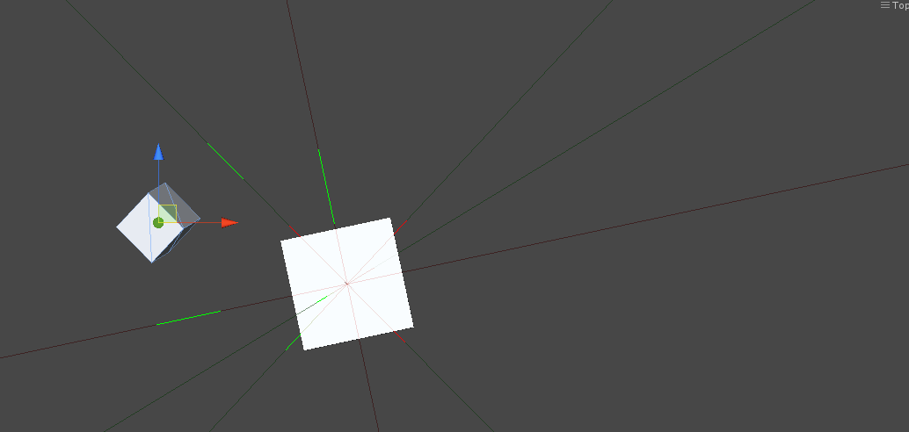
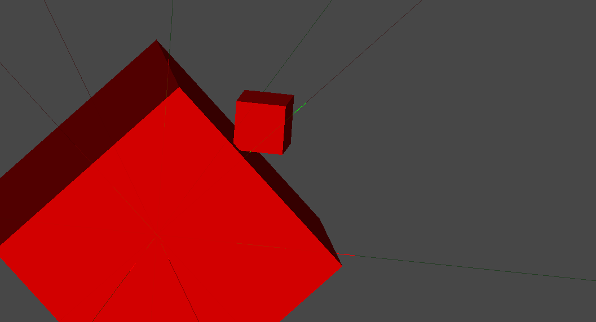

I was fooling around with collision a few weeks ago so I thought I’d write about it.

## SAT

The [Separating Axes Theorem](http://www.metanetsoftware.com/technique/tutorialA.html "Best explanation out there") is a simple theorem concerning the collision of convex polyhedra. Basically, you take two polyhedra and create an axis perpendicular to every face of both polyhedra. For two cubes you would have 12 axes, one perpendicular to each face of both cubes. However in the case of a single cube, you can see that there are really only 3 unique axes, as the other 3 are duplicate. That is a very useful optimization…

Once you have all the axes, iterate over each axis and project both polyhedra onto the axis. The two polyhedra intersect if and only if the projections overlap for each axis. What’s great about this is that if you have been summing the vector overlaps, you end up with a resolution vector, i.e. a vector that will push the objects apart!

The algorithm is fairly straightforward and it’s also fairly cheap, as the full number of axis projections only need to be computed for intersecting polyhedra. For every other polyhedra, the theorem will let us exit as soon as there is an axis found with no overlapping projections.

## Why?

Unity comes bundled with a powerful physics engine– so why would you ever use this technique? PhysX is great, but it’s also overkill for many applications. If you just need collisions, _not resolutions_, then SAT may be cheaper. This is the case much of the time, like when you fire a weapon and when it hits something you want it to explode. There’s no collision resolution needed, just the point of impact.

For my particular application, I had thousands of cubes and projectiles firing through them. If I had a Collider running on every cube, I would drain the planet of all natural resources. Instead, I partitioned the space into a hash, then did narrow phase collision detection with SAT. I was able to scale up to 50k cubes at a solid 60 fps with dozens of projectiles flying through them.

## Where?

I have extracted a simple demo and stuck it on [GitHub](https://github.com/thegoldenmule/SAT-Demo "GitHubbable").

Hit play, then move the objects around in the scene view. Turn on gizmos to see the axis projections.

It may be difficult to tell without playing around with it but each axis is drawn from the same origin. The light green axes are orthogonal to the faces of the small cube and the light red axes are those of the large cube. The solid green line segments are the projections of the small cube onto each of the axes.

When the two objects intersect, they both turn red, and as you can see from the screenshots, scale and rotation are both easily accounted for.

##  Further Thoughts

There is obviously a lot of room for improvement. While I created an interface that will work for any convex polygon, the more useful strategy is tooling that allows you to create convex collision shapes. For instance, creating a set of collision shapes from any mesh, or more wrappers for other primitives.

The interface also has a few shortcomings of its own. I would like to be able to use this same technique for “roundy” shapes, like a circle. SAT can be used for these, but the axes need to be created dynamically to point at the center of the circle. You will see what I’m talking about if you take a look at the article I linked to at the beginning.

Maybe my next iteration will include some of these generalizations.