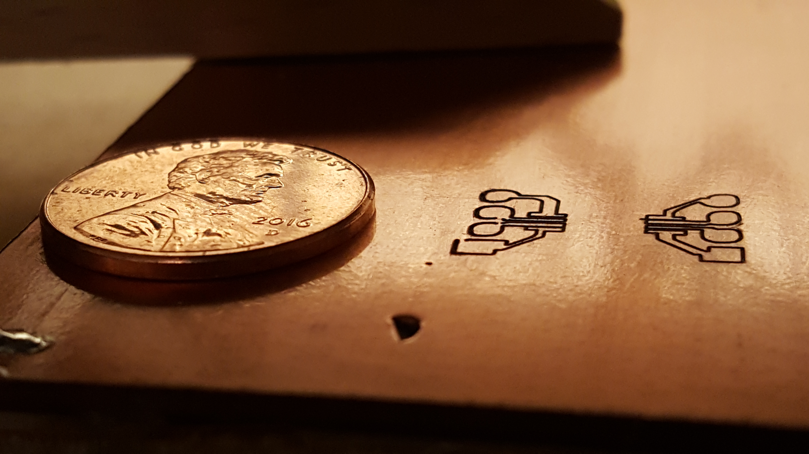

### PreRamble (Don’t Feel Bad skipping this part)

When my high school English class begin reading _The Canterbury Tales,_ our teacher begged us not to read “[The Miller’s Tale](https://en.wikipedia.org/wiki/The_Miller%27s_Tale)” because it was far too _bawdy_ (that remains the singular time I’ve heard someone use that word in earnest). I both believed him and rejected the notion of adding additional reading homework, so in the back of my mind I filed away: “don’t read The Miller’s Tale _or it will corrupt you_.”

Luckily, when I got home from school and told my mother we were reading _The Canterbury Tales_, the first thing she said to me was “you should read The Miller’s Tale.” Prodded by my mother, I read it. I don’t want to spoil it for you, but _bawdy_ is the correct term.

I didn’t much care for the Miller, not one of Chaucer’s best tales– but I did become absolutely enthralled with Chaucer. I went on to read every single Tale. I memorized the prologue in Middle English– translation lost the rhythm. I found it unbelievable that Chaucer could make something so beautiful out of a language that Klingons would fear to speak. I even read another of his lesser known works: _[Troilus and](https://en.wikipedia.org/wiki/Troilus_and_Criseyde "Troilus and Criseyde")_ _[Criseyde](https://en.wikipedia.org/wiki/Troilus_and_Criseyde "Troilus and Criseyde")_. I know, I know, I’m **really** cultured.

What conclusion should we draw from this? Hard to say. Maybe we should be begging more mothers to introduce their adolescents to bawdy fiction. I’m imagining a _powerful_ PSA. There’s also the very real possibility that if I hadn’t read the Miller’s bawdy tale, I would be much more successful or more knowledgeable or or or or–. Maybe this is really just some rando story that some rando bloggo wrote down because he wanted to sound well read. Maybe we’ll never know.

I think I’ll leave you to draw your own conclusions.

### Taxes (where this post actually beings)

With some tax return money I purchased an [XCarve](https://www.inventables.com/technologies/x-carve). This was awhile ago, but I’ve just recently returned to the pen.

I had my eye on it for ages! Seriously– _ages_. I was a younger man when I first coveted, but now I’m an ol’ CNC pro. I’ve cut out some wooden gears, some boxes, letters, a few other pieces of whatnottery–

This little number is made of mahogany, the little bar at the bottom is [art resin](https://www.artresin.com/) + food dye sanded down, and the sheen is from orange oil and elbow grease.

Wooden whatnots are cool and all, but the real reason I bought it is to mill [PCB](https://learn.sparkfun.com/tutorials/pcb-basics "My starting point.")s from copper blanks (<— THIS IS THE COGNITIVE LINK TO THE RANDOM STORY ABOUT THE MILLER’S TALE).

Milling a copper blank essentially means cutting copper off the blank to make little channels called _traces_ (I think) through which electricity can flow to form circuits.

I’ve been working on a hardware project for some time now and I’m getting to the point that I need to ditch the ol’ breadboard. It’s been real but now I have a machine that can magically make computers or something. I bought a bunch of copper blanks and have been going through tutorials– this is **really cool** stuff!

At its core, the XCarve is just an Arduino. There’s [a shield](https://www.inventables.com/technologies/gshield) with some stepper motors on it that literally sits on top of an Arduino dev kit. All of the stuff I’ve been working on lately has been Arduino, so I’m basically building Arduino _hardware_ with other Arduinos.

### The Tolerances are nuts

I’m making hobby level, single layer PCBs here. Modern motherboards have upwards of 10 layers of copper sandwiched between silicon and operate at a whole different scale. Even so– the tolerances I’m working with are nuts!

To give you an idea, the copper I am cutting away is 0.07mm thick– and that’s the thick stuff. You want to cut as close as you can so first you have to do something called _leveling_. These copper blanks _look_ flat, but not when dealing with tenths of a millimeter ([if only there were a unit for that](https://physics.stackexchange.com/questions/246996/what-are-the-units-for-tenths-of-a-millimeter) because the metric system is so bloody brilliant).

What you’re seeing here is the first step in leveling. I soldered a lead onto the copper blank that connects to a pin on my Arduino. Then I used an alligator clip to attach another lead from spindle to voltage. When the copper and spindle touch, the voltage is passed through the spindle into the copper to the Arduino– so that pin reads HIGH.

You plug this into a [web-based program](http://chilipeppr.com/) that incrementally moves the spindle closer to the blank and tests the pin. When the pin finally reads high it saves off the z coordinate. You do this in a grid to get a _surface approximation._ When you are ready to mill, the program takes the paths and adds the [bilinearly interpolated](https://en.wikipedia.org/wiki/Bilinear_interpolation) results of the grid as offsets. Didn’t I tell you this was **cool?**

### Kinks

I’m still working on them.

I can make larger traces decently, but there are some limits I’m not clear on.

First off, you can see where I accidentally had the z set wrong and punched a frigging hole in the blank. I’ve read that some iPhone PCBs [have this same issue](http://i0.kym-cdn.com/photos/images/newsfeed/000/727/911/515.gif). I’ve broken off a number of [limit switches](https://www.inventables.com/technologies/microswitch--2) which, when setup _correctly_ and you don’t hit the wrong button, mean the stepper motors don’t keep pushing when they’ve hit the boundaries.

In this trace you can see where I’m hitting some limits that are still unknown to me where once you get too fancy traces don’t come out quite right. You can see it’s not properly insulating traces.

### Next Steps

Next up: figuring out these limits 🙂 I’d really like to do a post next of moving through the entire flow: designing a circuit with a breadboard, making an Eagle schematic, generating gcode, setting up the CNC machine, and milling the PCB. As soon as I get some time…