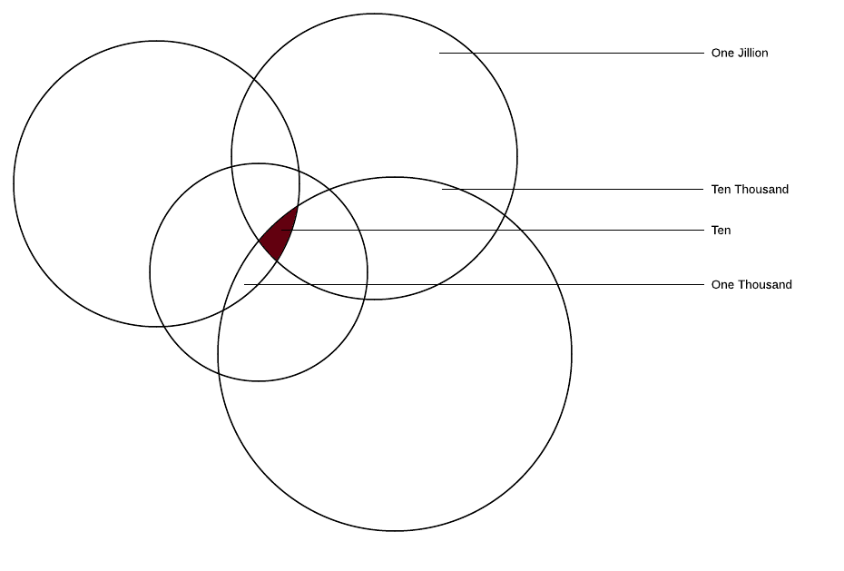

At the end of June, I was interviewed for the game development podcast, **[The Debug Log](http://thedebuglog.com/2017/06/29/episode-79-technical-directing-with-benjamin-jordan)**. It’s a great podcast if you’re interested in how games are actually made. They have tons of great episodes on the nitty gritty behind the scenes details, so go check them out.

On that episode I prolly said lots of dumb stuff (eek, I don’t interview well), but one thing that wasn’t dumb was when I briefly talked about how programmers _should not specialize_. I didn’t go very far into the idea, but I said something along the lines of “study topics as broad as you can find”. This flies in the face of more conventional wisdom: specialized doctors, lawyers, and other professionals make _loads_ more money than their non-specialized friends. The problem with this comparison, though, is that programming is not really so _professional_ or _white collar_. Programming is much more like a trade or a craft. Neurosurgeons do not add “wrist specialist” to their resumes to make themselves more attractive. However, a cabinet maker might mention that he or she can also build furniture or has a realtor’s license.

Please don’t take this as advice to go and add everything you can find to your resume. I have screened hundreds of resumes and seeing “git” in the _Experience_ section is an insta-trash. I’m also not advocating that people learn Hello World in 100 different languages (though that might be an interesting experiment).

Let me show you a pretty picture.

This is what specialization looks like in programming. You narrow in your focus and dive deeper into some specific niche. Maybe it’s graphics or AI. For AAA game studios, you’ll see career pages littered with _AI Programmer III_ or _Sr Networking Engineer_. What happens as you zero in and specialize is that the number of people in the world that can do what you do starts to shrink. This usually means employers want you more. This is great for awhile, but not only is it incredibly boring, it’s limited. If you dive all the way down into AI, there are still going to be 10,000 _AI Programmer XII_s that can do _exactly what you can do_. And heck, maybe in a pinch or with a good referral they’ll hire an _AI Programmer IX_ instead. There’s really not much difference.

Instead, focus on breadth– this will actually lead to an _increase_ in specialization. Here’s why:

These [Eulerian Circles](https://en.wikipedia.org/wiki/Venn_diagram#History) show exactly why. Every employer in the world wishes they could make just a handful of these magic hires. “We really need someone that knows machine learning _and_ UX.”

You just might be that one in a jillion hire.