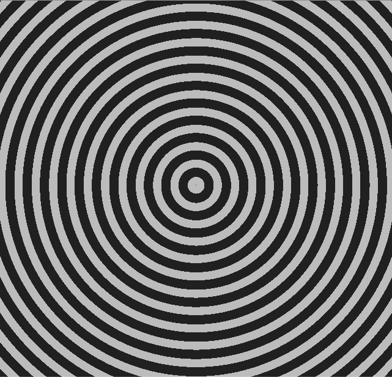
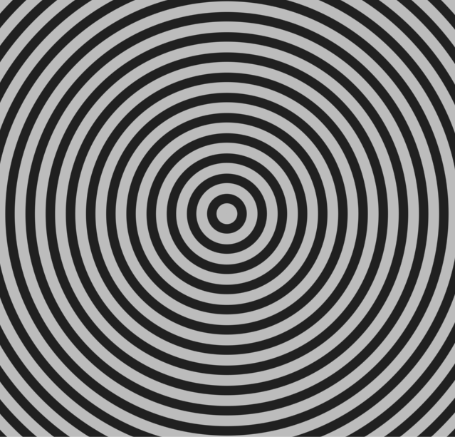

I’ve been having a ball going through the book [Texturing and Modeling: A Procedural Approach](http://www.amazon.com/Texturing-Modeling-Third-Edition-Procedural/dp/1558608486 "Buy it on Amazon!"). I’ve hardly cracked the book, really–but so far it’s been a lot of fun. One of the first procedural textures it studies is a brick texture. The book assumes you’re using RenderMan, but Unity’s surface shaders are actually very similar (so similar, in fact, it seems like Unity probably borrowed heavily from RenderMan).

Anyway, so here’s my brick shader.

[](images/bricks-3cbf02aa.png)

No big deal. It’s basically a couple of composed step functions setting color values like so:

```
float w = step(mortarWidthFloat, bricku) - step(1 - mortarWidthFloat, bricku);
float h = step(mortarHeightFloat, brickv) - step(1 - mortarHeightFloat, brickv);

color = lerp(_MortarColor, _BrickColor, w * h);
```

The next thing I tried was transforming the uvs to a polar coordinate system:

```
// first, distances from the center
float dx = IN.uv_MainTex.x - 0.5;
float dy = IN.uv_MainTex.y - 0.5;

// angle (append PI because dx and dy are rotated)
float theta = atan2(dy, dx) + PI;
// distance
float r = sqrt(dx * dx + dy * dy);
```

In the above transformation, I’m assuming the origin of my polar coordinate system is at (0.5u, 0.5v), i.e. in the center of my texture. Then I composed step and sin to generate the circles:

```
color = lerp(
	_BackgroundColor,
	_SpiralColor,
	step(_SpiralThickness, sin(r * _SpiralPeriod)));
```

Giving this result:

[](images/aliased_circles-9c5bab38.png)

This is cool and all… but look at all that aliasing! Luckily, my book has several solutions, including box filtering and a cubic filtering method. Essentially, step introduces a very unstable high frequency signal into the mix and you need to filter that high frequency signal out– a low pass filter.

CG includes the function smoothstep which uses a smooth, cubic interpolation rather than the discontinuous step. All that’s left to do is to refine the length of the cubic interpolation value. Here is what my shader looks like when I replace step with smoothstep and a value of 0.4:

[](images/antialiased_circles-e91a1a84.png)

Much better right? Here’s the updated step call:

```
smoothstep(_SpiralThickness - 0.4, _SpiralThickness, sin(r * _SpiralPeriod))
```

Now to figure out how to add normal perturbation…