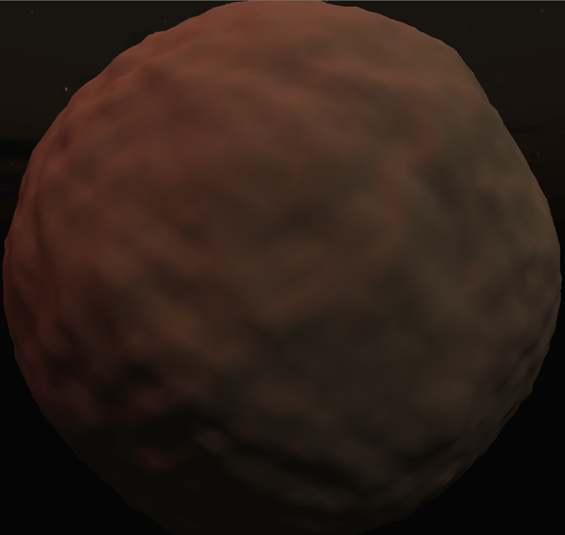

Update: part 2 [here](https://thegoldenmule.com/blog/2013/01/earthican-shader-2/).

I posted [a terrible demo](https://thegoldenmule.com/blog/?p=636 "Quick Post: Geospheres") a few weeks ago of a geosphere with some procedural mesh perturbation– then I ran off and never explained it. Then, in my last article, I finally walked through the magic behind geospheres. In this article, I refined my approach to spherical terrain generation and finally have the time to write out an explanation with a decent working demo.

But first– here’s a quick screenshot:

[](https://thegoldenmule.com/blog/2013/01/spherical-terrain-generation/thirty_thousand_iterations/)

Looks pretty good! This is after about thirty thousand fine iterations of my algorithm.

# The Algorithm

It’s dead simple to visualize and just as easy to implement. Basically, you take an arbitrary plane through the sphere. All vertices on one side of the plane you push out from the sphere, and all vertices on the other side of the plane you pull in. Repeat. That’s it! Here’s a screenshot after one iteration (I’ve upped the vector displacement so it’s easier to see):

[](https://thegoldenmule.com/blog/2013/01/spherical-terrain-generation/one_iteration/)

That’s really all there is to it. Once you get the algorithm going, it’s only a matter of tuning the number and magnitude of displacements. Here is the short snippet of code responsible:

```
public static void startSubdivision(int iterations, Mesh mesh, float displacementScalar) {
	// grab a reference
	Vector3[] vertices = mesh.vertices;

	// iterate
	for (int i = 0; i < iterations; i++)
	{
		// get a random, intersecting plane
		Plane plane = Plane.RandomInSphere(mesh.bounds.size.x);

		// now loop over the vertices of the sphere
		for (int j = 0; j < mesh.vertexCount; j++) 		{ 			Vector3 vertex = vertices[j]; 			// determine which side of the plane the vertex is on 			float dot = Vector3.Dot(vertex, plane.normal); 			// create a displacement vector in the correct direction 			Vector3 direction = new Vector3(vertex.x, vertex.y, vertex.z); 			direction.Normalize(); 			direction *= displacementScalar; 			if (dot > 0)
			{
				// move vertex out
				vertices[j] = vertex + direction;
			}
			else
			{
				// move vertex in
				vertices[j] = vertex - direction;
			}
		}
	}

	mesh.vertices = vertices;
	mesh.RecalculateNormals();
}
```

Lastly, here is a [working demo](https://thegoldenmule.com/labs/PlanarSphericalGen2/planardemo.html "Demo!") (left + right to rotate).

In the demo, I’m using the geosphere mesh generation method from my last article to generate a mesh with about 20k vertices. Let it sit for as long as you like!