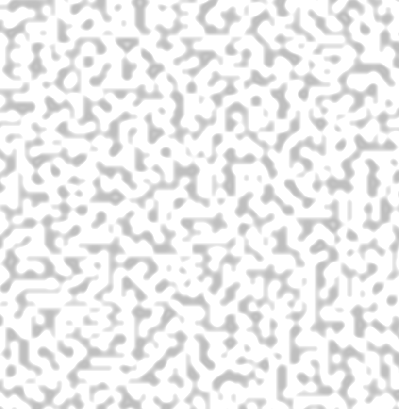

Update: Part II of this post can be found [here](https://thegoldenmule.com/blog/?p=721 "Real-Time Clouds Pt 2: The Actual Cloud Part").

Update 2: The source can be found on [GitHub](https://github.com/thegoldenmule/RealtimeClouds "Real time clouds can Git it!").

## Where to begin?

As a [previous post](https://thegoldenmule.com/blog/?p=645 "Procedural Texture Fun") pointed out, I’ve been working my way through “[Texturing and Modeling: A Procedural Approach](http://www.amazon.com/Texturing-Modeling-Third-Edition-Procedural/dp/1558608486 "Buy it now!")” and it’s blowing my dang mind. For instance, did you know that Scorched Earth is actually not the best example of procedural terrain generation? Not only is this book all fun and mathy, it also has pictures, so it qualifies as something I can wrap my brain around.

Anyway, one of the first sections in the book is dedicated to the study of noise functions, since noise functions are the basis of good procedural texturing and modeling. This class of functions, at their most basic, simply generate evenly distributed random numbers. Easy, right? Turns out, not so much. The book quickly informed me that that’s not all a noise functions needs to be useful. There is a pretty long list of requirements that make up a good noise function.

## Classic Noise

What I don’t know about noise could fill a book. Lucky for you, however, I’m reading that book right now.

Apparently most noise functions fall into a large category called lattice noise. The idea behind lattice noise is simple: evenly distribute PRNs (pseudo-random numbers) over an integral field, then smoothly interpolate between them. Nifty idea, right?

I implemented a lattice noise function that bilinearly interpolated between integral tuples, but it was gross. It looked like a bunch of squares, because, although it was continuous, it was not C1 continuous, so you could see dramatic changes along the bounds of each cell. Most of the time you would instead cubically interpolate or use a spline– both of those methods produce good C1 continuous noise.

Anyway, there is a subclass of lattice noise called gradient noise. In this approach, imagine that instead of a PRN at each lattice point, you assign a scalar vector representing a [gradient](http://en.wikipedia.org/wiki/Gradient "Cool!"). A gradient is a vector that points in the direction of the greatest rate of increase, with the magnitude of the increase. So, really when you define a gradient field, you can kind of imagine that you’re defining a surface, with each lattice point pointing up the steepest incline (this is not mathematically precise, but it helps me visualize). Now the interpolation is between gradients instead of lame old PRNs.

Interpolation over a gradient field is usually done a bit differently than in many other lattice noises, but it’s still familiar as it’s a form of bilinear interpolation (so it’s dang cheap). Since each lattice point is a vector, you linearly interpolate between the dot products. Here’s some source (in CG)– it’ll all make sense in a minute:

```
float noise(float2 P) {
	// Integer part, scaled and offset for texture lookup
	float2 Pi = ONE * floor(P) + ONEHALF;

	// Fractional part for interpolation
	float2 Pf = frac(P);

	// Noise contribution from lower left corner
	float2 grad00 = tex2D(_PermTexture, Pi).rg * 4.0 - 1.0;
	float n00 = dot(grad00, Pf);

	// Noise contribution from lower right corner
	float2 grad10 = tex2D(_PermTexture, Pi + float2(ONE, 0.0)).rg * 4.0 - 1.0;
	float n10 = dot(grad10, Pf - float2(1.0, 0.0));

	// Noise contribution from upper left corner
	float2 grad01 = tex2D(_PermTexture, Pi + float2(0.0, ONE)).rg * 4.0 - 1.0;
	float n01 = dot(grad01, Pf - float2(0.0, 1.0));

	// Noise contribution from upper right corner
	float2 grad11 = tex2D(_PermTexture, Pi + float2(ONE, ONE)).rg * 4.0 - 1.0;
	float n11 = dot(grad11, Pf - float2(1.0, 1.0));

	// Blend contributions along x
	float2 n_x = lerp(float2(n00, n01), float2(n10, n11), fade(Pf.x));

	// Blend contributions along y
	float n_xy = lerp(n_x.x, n_x.y, fade(Pf.y));

	// We're done, return the final noise value.
	return n_xy;
}

float fade(float t) {
	// Improved fade, yields C2-continuous noise
	return t*t*t*(t*(t*6.0-15.0)+10.0);
}
```

Since you were wondering, no I didn’t write a large portion of this code. It’s “adapted from” (stolen from) [Stefan Gustavson’s implementation](http://www.davidcornette.com/glsl/GLSL-noise.zip "Oooooh yah"). See what’s going on here? It looks tricky but it’s not. You take the fractional part and you use dot products to find your four values to interpolate between. Then you bilinearly interpolate between them with a slick fade function for kicks (or, rather, so it’s C2 continuous).

What I’m leaving out here, is how to generate the lattice. As you can see in the code above, my lattice is passed in to the shader as a texture. How do I generate this lattice? It’s actually not that simple. Here’s the accompanying C# code to generate the texture:

```
private static int[] PERM = new int[256]{151,160,137,91,90,15,
	131,13,201,95,96,53,194,233,7,225,140,36,103,30,69,142,8,99,37,240,21,10,23,
	190, 6,148,247,120,234,75,0,26,197,62,94,252,219,203,117,35,11,32,57,177,33,
	88,237,149,56,87,174,20,125,136,171,168, 68,175,74,165,71,134,139,48,27,166,
	77,146,158,231,83,111,229,122,60,211,133,230,220,105,92,41,55,46,245,40,244,
	102,143,54, 65,25,63,161, 1,216,80,73,209,76,132,187,208, 89,18,169,200,196,
	135,130,116,188,159,86,164,100,109,198,173,186, 3,64,52,217,226,250,124,123,
	5,202,38,147,118,126,255,82,85,212,207,206,59,227,47,16,58,17,182,189,28,42,
	223,183,170,213,119,248,152, 2,44,154,163, 70,221,153,101,155,167, 43,172,9,
	129,22,39,253, 19,98,108,110,79,113,224,232,178,185, 112,104,218,246,97,228,
	251,34,242,193,238,210,144,12,191,179,162,241, 81,51,145,235,249,14,239,107,
	49,192,214, 31,181,199,106,157,184, 84,204,176,115,121,50,45,127, 4,150,254,
	138,236,205,93,222,114,67,29,24,72,243,141,128,195,78,66,215,61,156,180};

private static int[,] GRAD3 = new int[16, 3]{
	{0,1,1},{0,1,-1},{0,-1,1},{0,-1,-1},
	{1,0,1},{1,0,-1},{-1,0,1},{-1,0,-1},
	{1,1,0},{1,-1,0},{-1,1,0},{-1,-1,0}, // 12 cube edges
	{1,0,-1},{-1,0,-1},{0,-1,1},{0,1,1}}; // 4 more to make 16

public static Texture2D GenerateValueNoiseTexture()
{
	const int dim = 256;
	Texture2D tex = new Texture2D(dim, dim);
	Color32[] colors = new Color32[dim * dim];

	for (int i = 0; i < dim; i++)
	{
		for (int j = 0; j < dim; j++)
		{
			int offset = i * dim + j;
			int value = PERM[(j + PERM[i]) & 0xFF];

			colors[offset].r = (byte)(GRAD3[value & 0x0F, 0] * 64 + 64);    // Gradient x
			colors[offset].g = (byte)(GRAD3[value & 0x0F, 1] * 64 + 64);    // Gradient y
			colors[offset].b = (byte)(GRAD3[value & 0x0F, 2] * 64 + 64);    // Gradient z
			colors[offset].a = (byte)value;                                 // Permuted index
		}
	}

	tex.SetPixels32(colors);
	tex.anisoLevel = 0;
	tex.filterMode = FilterMode.Point;
	tex.Apply();

	return tex;
}
```

What is going on here? That’s a very good question. Essentially, we have engineers getting fancier than need be.

PERM is a sequence of random integers from 0 to the dimension of the texture, which must be a power of two, in this case 256. Inside the for loops you can see some fancy nonsense going on that relies on the fact that i % 256 is equivalent to i & 256. PERM is mapped onto itself so that with a short sequence of integers, you can generate a long list of PRNs. Then, that value is mapped into GRAD3, which provide gradient values for rgb. The table of gradients doesn’t actually need to be that long, but it lists all possible component gradients for an integral field.

Whew. Lots of stuff, right? Well here’s where we’re rewarded:

[](https://thegoldenmule.com/blog/?attachment_id=714)Look at that beautiful noise.

## Further Thoughts

There are several thoughts I’m left with for potential future enjoyment:

1\. What I’ve read suggests some potential problems with classic noise. As you can see in the screenshot, it’s clear that this noise is axis aligned (see the underlying lattice? even a little?). What would be really nice is if there were no axes present in the final noise function. Turns out, Mr Perlin himself noticed this too and invented a whole new kind of noise called simplex noise to solve some of the problems associated with this (there were other reasons too). I should do a dive into simplex noise in the future.

2\. After showing this to one of my coworkers, he suggested that I actually generate the texture on the shader as well. Or, rather, implement a function that acts like I’m sampling from a texture (i.e. my lattice lookup table). I think I may actually try this one soon…

Update: Part II of this post can be found [here](https://thegoldenmule.com/blog/?p=721 "Real-Time Clouds Pt 2: The Actual Cloud Part").