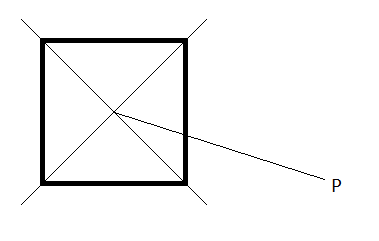

Q: Given a square and a point outside of the square, how do I quickly determine which “quadrant”, (top, bottom, left, or right) the point is in?

It’s helpful to draw a picture:

Answer?

Most people probably jump to trig, which is alright– but then press them that trig functions are not cheap. How might you get at the information more efficiently? Everyone always jumps to trig lookup tables. Boo. Those are boring. There’s a much simpler way!

Draw a line from the point in question to the center of the square.

See it yet? You don’t need trig, you just need arithmetic!

Remember what slope is? It’s a measure of how slanted a line is. You can find it easily with arithmetic: $$m=\\frac{y\_2-y\_1}{x\_2-x\_1}$$. If you look closely at my picture, you can see exactly how this can give us the answer. We know that if $$-1<m<1$$, the point is either on the right or the left of the square. If $$P$$ has a greater $$x$$, then $$P$$ is on the right. Using this method we can very quickly determine which side of the square the point is.

Another great thing about this question, is that you can easily extend it. Once you get here, ask how the method can be extended to any rectangle!