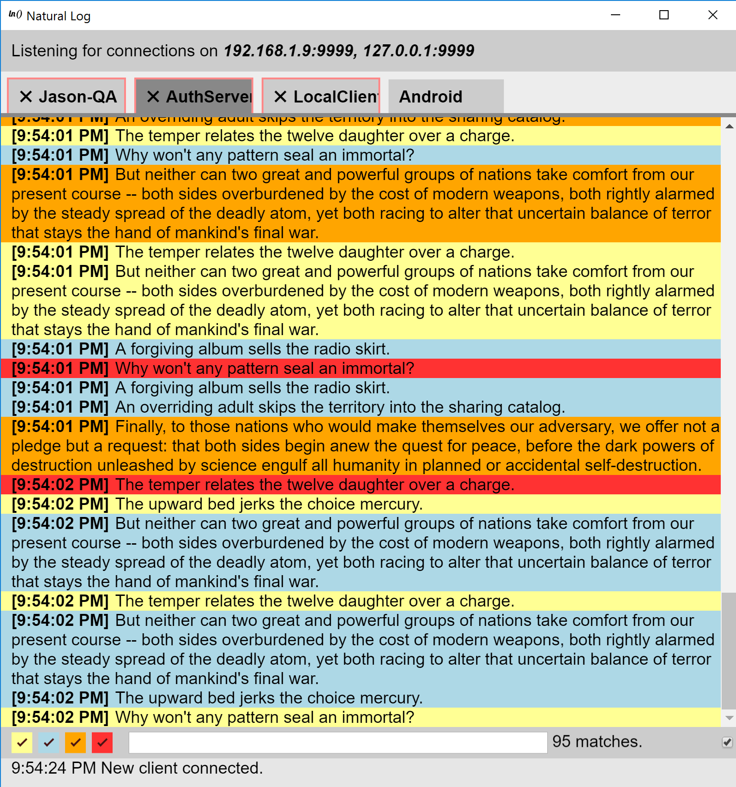

I’ve managed to make a very simple program that will take up a whopping **107,207,225 bytes** of disk space and roughly **20,027,801 bytes** of memory _when idle_. Imagine how long it would take to make that much memory [in Minecraft](http://minecraft.gamepedia.com/Tutorials/Redstone_computers#Random_Access_Memory). This program would never run on redstone, my friends.

This program is able to display text in many different colors: sometimes red, sometimes blue, rarely yellow but _never_, under any circumstances does it display mauve text.

It’s a log server, aptly named _natural-log_. You can find it [here](https://github.com/thegoldenmule/naturallog).

What you’re seeing here is multiple clients connected to one, aptly named, natural-log server. Each client it spamming it up with logs. Man there are so many logs going on here.

It’s cool because you can have, say, some server you’re developing spew logs to the same place your iOS client is spewing logs: and they’ll be divvied up into tabs. Say no to getting logs from some file on device– instead connect to the, aptly named, natural-log server and view them on your laptop!

### Closing soliloquy

In all the haste, I forgot to mention this is built on [ELECTRON](https://electron.atom.io/) which makes it giant and take tons of memory. It was my first foray (maybe second) into Electron. Here’s the skinny: Electron may be terrible in a lot of ways (that’s why Slack Desktop app crashes constantly…), but it certainly makes cross platform app development simple. There aren’t really that many choices, even now, for that sort of thing. Swing? Qt? Xamarin? Seriously what should I have used instead cause this is nuts–