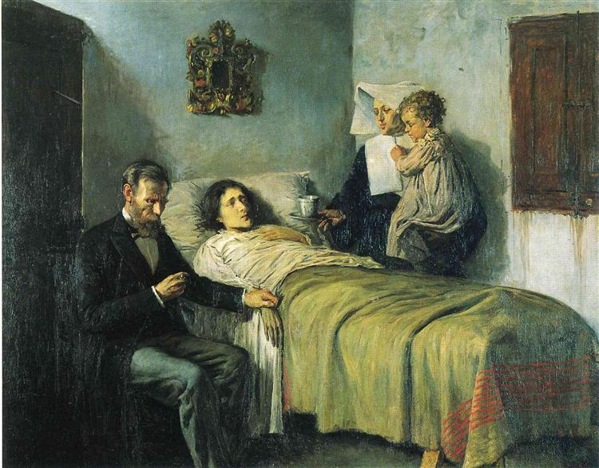

I am not particularly knowledgeable about fine art. I’m sure I’ve mentioned it before but _Drawing 101_ almost destroyed me. Six hours of hand cramps, they assured me, was the price to pay for this halfway decent pointillist rendering of a toilet. For whatever reason, it was a _complete shock_ that drawing well took time.

Enough About Me

Picasso is one of the more recognizable names in art: a bit like _thegoldenmule_ in the Elite Software Engineering community that definitely exists and I’m a part of. Like most anyone, I recognize his more famous paintings and make the obvious parallel every single time I see a flounder (if you’re following along, it’s because flounders have two eyes on the same side of their head and look weird). Picasso’s _Le Rêve_ once sold for $120 million. That’s the equivalent of selling my toilet rendering for $1 every second for almost four years. Which is my retirement plan.

_“Science and Charity,” 1897 (Photo: Wiki Art Public Domain)_

However, as any art buff knows and I didn’t, Picasso only began painting people “wrong” after extensive training in painting people right. Picasso painted the above, _Science and Charity_, when he was fifteen years old. There must be something special about that age because when _I_ was 15, I had mastered the programming equivalent of oil painting: Christmas-themed Galaga clones in Flash.

Eventually Picasso abandoned classic oil painting, diving into other styles and developing his own. He went on to make a name for himself in sculpting, printmaking, ceramics, stage designing, and poetry– so again, some pretty hard parallels to _Yours Truly_.

At some point along the way, he uttered what may be his most famous words:

> It took me four years to paint like Raphael, but a lifetime to paint like a child.
>
> Pablo Picasso

Let’s take a moment to appreciate the _[chutzpah](https://www.youtube.com/watch?v=j6jHRwYzCDQ)_ on the first half of that statement.

Computers

I would consider myself a computer power-user. I’ve used both split-keyboards and JavaScript, so yah. This doesn’t mean I know how to make side by side columns in Word but it does mean I have come to a very similar understanding of Picasso’s idea from a computing perspective.

In [_Dealers in Lightning_](https://www.amazon.com/Dealers-Lightning-Xerox-PARC-Computer/dp/0887309895)_: The story of Xerox PARC_, it’s clear that a vast majority of those minds were absolute masters of their craft, and– strangely enough, many of those minds went the same direction as Picasso’s.

_Alan Kay and the prototype of Dynabook | Marcin Wichary_

Alan Kay, the group’s foremost philosopher, spent his early life bending computers to his will: imagining and implementing technologies we now take for granted. Where is he now? He’s figuring out how to [program like a child](https://dynamicland.org/).

Bret Victor, the guy that probably invented the original iOS experience (and may have inadvertently destroyed the world as a result), is [doing the same thing](https://dynamicland.org).

The “Father of Computer Graphics”, Ivan Sutherland, brought _children_ into the lab to play with Sketchpad (both the GUI and object oriented programming find their roots here) and test other applications.

John Carmack, co-founder of id Software, invented algorithmic innovation after innovation to create better _games_, not better spreadsheets.

Seymour Papert, co-director of MIT Artificial Intelligence Lab and unofficial founder of the Maker Movement– a man who earned not just one more math PhD than me but somehow two (neither are honorary, they are separate theses), built his entire life’s work in computing around how to [think like a child](https://www.amazon.com/Mindstorms-Children-Computers-Powerful-Ideas/dp/0465046746/).

Unlearning

I do not think the secret of mastery is locked in the mind of a child. However, there is a pattern to recognize here: _when the masters hit the end, they turn around and begin unlearning_. They take off their shoes and step into much smaller ones. They get bored with their expert perspectives and start looking through more youthful eyes.

It makes me want to stop coding for a second and ponder: What should I unlearn today?